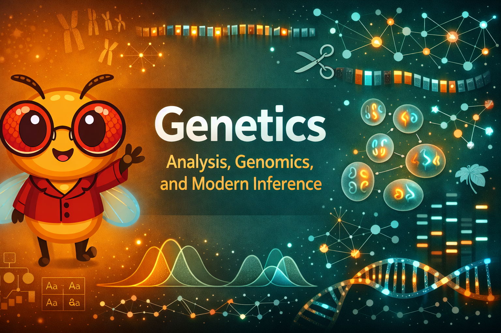

# Welcome

{ width="100%" }

Welcome to **Genetics: Analysis, Genomics, and Modern Inference**, an interactive intelligent textbook for advanced high school and early undergraduate students.

## About This Book

This course focuses on how geneticists reason, analyze data, and connect genotype to phenotype in modern research and applied contexts. Topics include genetic inference and probabilistic reasoning, genome structure and variation, quantitative and population genetics, molecular mechanisms of gene regulation, experimental genetics, genomics and bioinformatics workflows, human genetics and precision medicine, and ethical implications.

## Who This Book Is For

Advanced high school students and early undergraduate college students who have completed a foundational biology course covering DNA structure, transcription, translation, and simple Mendelian inheritance.

## How to Use This Book

Use the navigation menu to explore:

- **Chapters** - Main educational content across 18 topics
- **Learning Graph** - Interactive concept visualization
- **Simulations** - Interactive MicroSims for hands-on learning
- **Glossary** - Key terms and definitions

## Getting Started

Start with [Chapter 1: Genetic Inference and Probabilistic Reasoning](chapters/01-genetic-inference-probabilistic-reasoning/index.md) to begin your learning journey.
