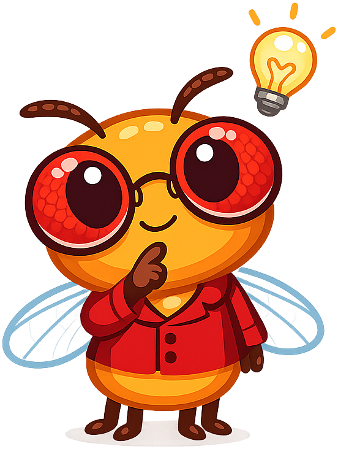
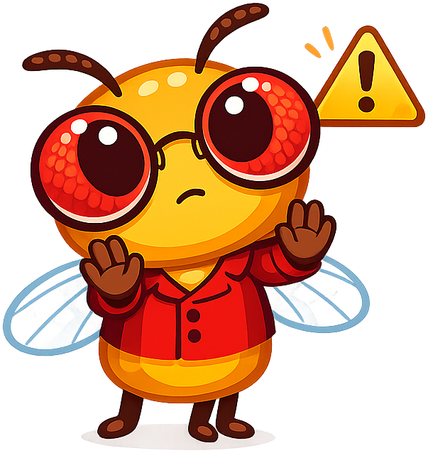
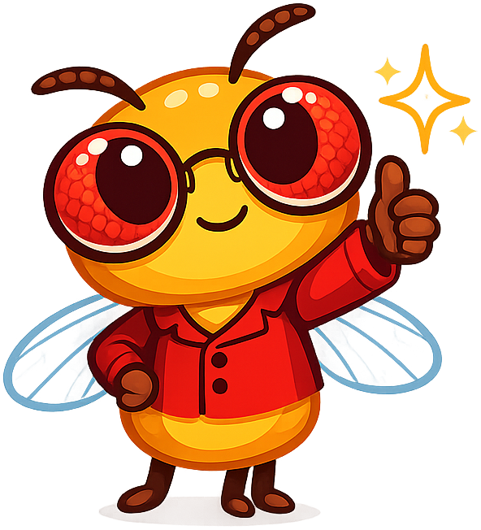

# Mascot Style Guide

This page shows all mascot admonition styles for Dottie the Drosophila.

!!! mascot-neutral "A Note from Dottie"
    
    This is the neutral style, used for general sidebars or introductions.

!!! mascot-welcome "Welcome!"
    
    This is the welcome style, used at chapter openings.
    Let's look at the evidence!

!!! mascot-thinking "Key Insight"
    
    This is the thinking style, used for key concepts and important discoveries.

!!! mascot-tip "Dottie's Tip"
    
    This is the tip style, used for hints and advice.

!!! mascot-warning "Watch Out!"
    
    This is the warning style, used for common mistakes and pitfalls.

!!! mascot-celebration "Well Done!"
    
    This is the celebration style, used for achievements and chapter completion.

!!! mascot-encourage "Keep Going!"
    
    This is the encouraging style, used for difficult content where students may struggle.
